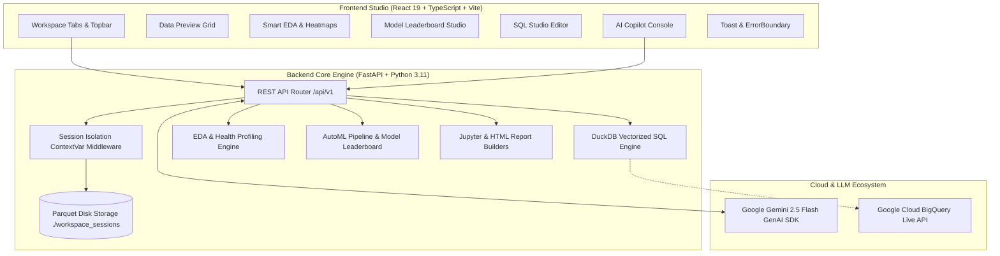

# 🚀 DataPilot AI — Enterprise Agentic Data Science Workspace

[](https://fastapi.tiangolo.com)
[](https://react.dev)
[](https://www.typescriptlang.org)
[](https://duckdb.org)
[](https://ai.google.dev)
[](https://www.docker.com)
[](LICENSE)

**DataPilot AI** is a production-grade, agentic data science studio designed to transform raw tabular datasets into interactive dashboards, statistical health profiles, exploratory visual analytics, automated multi-model machine learning benchmarks, and reproducible Jupyter / PyTorch notebooks through autonomous AI tool calling.

---

## 📑 Table of Contents

1. [Architectural Overview](#-architectural-overview)
2. [End-to-End Core Capabilities](#-end-to-end-core-capabilities)
3. [UI Spatial Hierarchy & Components](#-ui-spatial-hierarchy--components)
4. [Backend Engine & Agentic Tool Calling](#-backend-engine--agentic-tool-calling)
5. [API Contract (v1 REST Endpoints)](#-api-contract-v1-rest-endpoints)
6. [Directory Structure](#-directory-structure)
7. [Installation & Getting Started](#-installation--getting-started)
8. [Docker Production Deployment](#-docker-production-deployment)
9. [Configuration & Environment Variables](#-configuration--environment-variables)
10. [License](#-license)

---

## 🏛 Architectural Overview

DataPilot AI enforces a **strict architectural separation of concerns**:
* **Google Gemini Agent (2026 SDK)**: Autonomous reasoning, function calling loop, and data insight explanation.
* **FastAPI Backend (DuckDB + Scikit-Learn + Parquet)**: Vectorized in-memory SQL execution, automated profiling, and multi-model training without arbitrary code execution vulnerabilities.
* **React + Vite Frontend (Recharts + Tailwind + Toast + Error Boundaries)**: Lazy-loaded dashboards, interactive heatmaps, geospatial maps, and responsive data grids.



---

## ⚡ End-to-End Core Capabilities

* 🛡️ **Zero `exec()` Security**: Data operations, statistical calculations, and cleaning routines execute purely via verified, pre-defined tool functions.
* 💾 **Persistent Parquet Storage**: Volatile in-memory sessions are safely written to disk as `.parquet` files for crash survival and rapid rehydration.
* 🤖 **Autonomous AI Tool Calling**: Full support for the 2026 `google-genai` SDK standard (`types.Tool(function_declarations=[...])`) with visible execution telemetry badges.
* 📊 **Automated Health Score & EDA**:
  - 0–100 Dataset Health Score (penalizing null values and duplicate rows).
  - Pearson correlation matrix heatmap.
  - Geospatial scatter mapping auto-detecting latitude/longitude fields.
  - Sparkline histograms with quartile metrics ($Q_1$, $\text{Median}$, $Q_3$) and IQR outlier detection.
* 🏆 **AutoML Model Leaderboard**:
  - Automatically identifies Classification vs. Regression targets.
  - Evaluates Linear/Logistic Regression, Random Forest, and Gradient Boosting simultaneously.
  - Ranks algorithms on Accuracy/F1 or RMSE/R² with Tree Feature Importances explainability.
* ⚡ **Unified SQL Studio**: Run instant queries over in-memory session datasets using **DuckDB** or toggle to **Google Cloud BigQuery** for live enterprise data exploration.
* 📄 **One-Click Export Deliverables**: Download reproducible `.ipynb` Jupyter Notebooks, printable HTML Executive Summaries, and GPU-ready PyTorch Colab scripts.

---

## 🖼 UI Spatial Hierarchy & Components

```text
┌────────────────────────────────────────────────────────────────────────────────────────┐
│ TOPBAR: Brand | Active Session | Export Center | Activity History | Theme | Health Status│
├───────┬────────────────────────────────────────────────────────────────────────────────┤
│ N     │ DATA EXPLORER  │ WORKSPACE TABS: Preview | Summary | Charts | EDA | Models | SQL│
│ A     ├────────────────┼───────────────────────────────────────────────────────────────┤
│ V     │ [Upload CSV]   │ TOP STAT CARDS                                                │
│       │                │ [ 10,418 Rows ] [ 12 Columns ] [ Health Score: 94% ] [ 0 Dups]│
│ R     │ Active Dataset │                                                               │
│ A     │                │ ACTIVE WORKSPACE TAB (Lazy Loaded + Error Boundary Protected) │
│ I     │ Typed Columns  │ • Data Preview Grid with dynamic sorting & pagination         │
│ L     │ # PassengerId  │ • Smart EDA: Correlation Heatmap, Geo Map, Histograms         │
│       │ # Survived     │ • Model Studio: 3-Model Leaderboard & Feature Importances     │
│       │ # Age (19.9%)  │ • SQL Studio: DuckDB (SELECT * FROM df) & BigQuery Runner     │
├───────┴────────────────┴───────────────────────────────────────────────────────────────┤
│ AI COPILOT: ⚡ Tool executed: describe_dataset() ✓ | [Ask questions...]          [Send]│
└────────────────────────────────────────────────────────────────────────────────────────┘
```

---

## 🛠 Backend Engine & Agentic Tool Calling

When a user prompts the AI Copilot (e.g. *"Show top 5 passengers by fare with class breakdown"*), the backend executes an autonomous tool loop:

1. **Prompt & Context Ingestion**: Attaches the query to conversational memory with dataset schema.
2. **Gemini Tool Invocation**: Gemini calls `run_sql_query(query="SELECT Pclass, AVG(Fare) FROM df GROUP BY Pclass")`.
3. **Deterministic DuckDB Execution**: DuckDB executes the query against the active in-memory session DataFrame `df`.
4. **Structured Part Response**: Result is packaged via `types.Part.from_function_response` and returned to Gemini.
5. **Multi-Modal Synthesis**: Gemini explains the findings while the frontend renders real-time data badges, previews, and interactive charts.

---

## 📡 API Contract (v1 REST Endpoints)

| Method | Endpoint | Description |
|---|---|---|
| `POST` | `/api/v1/upload` | Ingests CSV/XLSX/JSON and initializes Parquet session store |
| `GET` | `/api/v1/profile` | Computes Dataset Health Score, null rates, and column stats |
| `GET` | `/api/v1/eda` | Generates smart correlation heatmap, geo map, and distribution bins |
| `POST` | `/api/v1/train` | Runs 3-model AutoML training pipeline and builds Leaderboard |
| `POST` | `/api/v1/query` | Executes unified SQL query via DuckDB or BigQuery |
| `POST` | `/api/v1/copilot/chat` | AI Copilot multi-turn tool calling conversation loop |
| `GET` | `/api/v1/export/notebook` | Streams reproducible `.ipynb` Jupyter Notebook download |
| `GET` | `/api/v1/export/report` | Streams standalone executive HTML report download |
| `GET` | `/health` | Live backend health, environment mode, and active session count |

---

## 📂 Directory Structure

```text
DataScience/
├── backend/
│   ├── app/
│   │   ├── agents/           # Gemini Analyst Agent tool definitions
│   │   ├── api/              # REST API routers (datasets, automl, routes)
│   │   ├── connectors/       # Google BigQuery live client connector
│   │   ├── data/             # Session store (Parquet), quality profiler, eda_engine, automl
│   │   ├── llm/              # Gemini 2026 SDK client pool & orchestrator
│   │   ├── reports/          # Jupyter .ipynb and HTML executive report generators
│   │   ├── sql/              # Unified SQL routing engine (DuckDB + BigQuery)
│   │   └── tools/            # Local deterministic analytical execution tools
│   ├── Dockerfile            # Python 3.11-slim container definition
│   ├── main.py               # FastAPI entry point, structured logging, CORS, exception handling
│   └── requirements.txt      # Python dependencies (duckdb, scikit-learn, pyarrow, etc.)
│
├── frontend/
│   ├── src/
│   │   ├── components/
│   │   │   ├── charts/       # Interactive Recharts visualizers
│   │   │   ├── common/       # ErrorBoundary, SkeletonLoader, Toast system
│   │   │   ├── copilot/      # Agentic chat panel with tool badges
│   │   │   ├── data-grid/    # Paginated data table & filter bar
│   │   │   ├── eda/          # 4-view EDA suite (Charts, Heatmap, Geo, Grid)
│   │   │   ├── explorer/     # Drag-and-drop uploader & schema inspector
│   │   │   ├── export/       # Export center modal
│   │   │   ├── models/       # AutoML leaderboard & feature importance studio
│   │   │   ├── overview/     # Health Score gauge & summary metrics
│   │   │   └── sql/          # SQL Studio with engine toggle
│   │   ├── hooks/            # useDebounce and custom React hooks
│   │   ├── services/         # Typed API client functions
│   │   ├── types/            # Centralized TypeScript interfaces
│   │   └── App.tsx           # Master layout with Suspense lazy loading & providers
│   ├── Dockerfile            # Multi-stage Node 20 builder + Nginx production server
│   └── package.json
│
├── docker-compose.yml        # Multi-container orchestration
├── .dockerignore             # Optimized build context
├── .gitignore                # Production secrets and cache exclusions
└── README.md                 # Complete documentation
```

---

## 💻 Installation & Getting Started

### Prerequisites
* **Python 3.10+**
* **Node.js 18+** & **npm**

### 1. Backend Setup

```bash
cd backend
python -m venv venv

# Windows:
venv\Scripts\activate
# macOS/Linux:
# source venv/bin/activate

pip install -r requirements.txt
python -m uvicorn main:app --reload --port 8000
```
API Documentation: **[`http://localhost:8000/docs`](http://localhost:8000/docs)**.

### 2. Frontend Setup

```bash
cd frontend
npm install
npm run dev
```
Frontend Workspace: **[`http://localhost:5173`](http://localhost:5173)**.

---

## 🐳 Docker Production Deployment

Run the complete stack with a single command using Docker Compose:

```bash
# Build and start both frontend & backend containers
docker compose up --build -d

# Verify container status
docker compose ps

# View backend logs
docker compose logs -f backend
```

---

## 🔑 Configuration & Environment Variables

Configure `backend/.env` before launching:

```env
# Google Gemini API Key
GEMINI_API_KEY="AIzaSyYourGoogleAIStudioKey"

# Production Environment Settings
ENVIRONMENT="production"
ALLOWED_ORIGINS="http://localhost:5173,http://localhost:80,http://localhost:3000"
SESSION_STORAGE_DIR="./workspace_sessions"

# Optional: Google Cloud BigQuery Credentials
# GOOGLE_APPLICATION_CREDENTIALS="/path/to/service-account.json"
# GCP_PROJECT="your-gcp-project-id"
```

---

## 📄 License

Distributed under the MIT License. See `LICENSE` for more information.